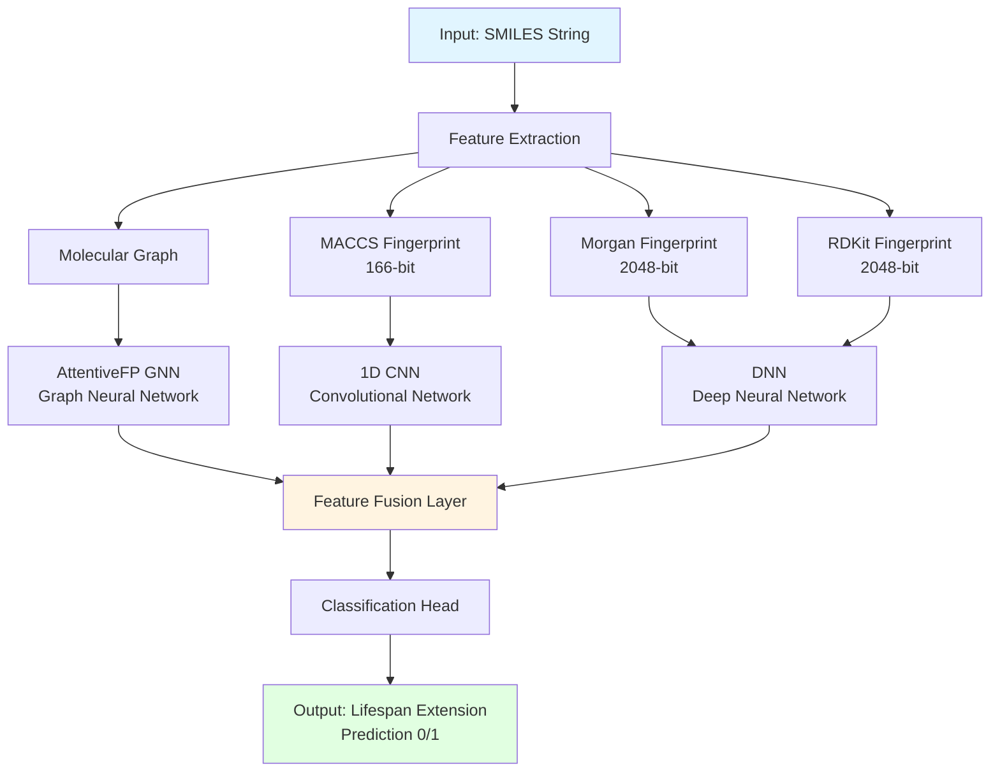
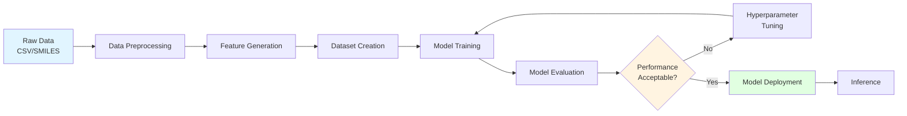

# YanNian-Mol 🧬

<div align="center">

**AI-Powered Longevity Prediction for Model Organisms**

[](https://www.python.org/downloads/)
[](LICENSE)
[](https://github.com/psf/black)

*A deep learning framework for predicting compound effects on lifespan across model organisms*

</div>

---

## 📖 Introduction

**YanNian-Mol** is a comprehensive deep learning pipeline designed to predict the effects of chemical compounds on lifespan extension in model organisms. The framework leverages multi-modal molecular representations and state-of-the-art neural network architectures to identify potential longevity-promoting compounds, accelerating drug discovery and aging research.

### ✨ Key Features

- 🧠 **Multi-Modal Deep Learning Architecture**
  - AttentiveFP Graph Neural Network for molecular graph structures
  - 1D CNN for MACCS fingerprints
  - Deep Neural Network for Morgan and RDKit topological fingerprints
  - Ensemble fusion for robust predictions

- 🔬 **Modular and Extensible Design**
  - Clean, well-organized codebase
  - Comprehensive test coverage (>80%)
  - Extensive documentation
  - Easy to customize and extend

- ⚡ **Performance Optimized**
  - Feature caching mechanism for faster preprocessing
  - Mixed precision training support
  - GPU memory optimization
  - Parallel processing capabilities
  - Efficient data loading pipelines

- 📊 **Complete Workflow**
  - End-to-end pipeline from raw SMILES to predictions
  - Data preprocessing and validation
  - Model training with callbacks
  - Inference and visualization
  - Comprehensive logging and monitoring

---

## 🎯 Applications

- 🧪 **Longevity Drug Screening** - Identify compounds that extend lifespan in model organisms
- 💊 **Compound Activity Prediction** - Predict biological activity of novel molecules
- 🔍 **Lead Optimization** - Guide molecular structure modifications for improved efficacy
- 📈 **Aging Research** - Accelerate discovery of interventions targeting aging pathways
- 🧬 **Cross-Species Translation** - Leverage findings across different model organisms

---

## 🚀 Quick Start

### Installation

```bash
# Clone repository
git clone https://github.com/yuzhounaut/YanNian-Mol.git
cd YanNian-Mol

# Install dependencies
pip install -r requirements.txt

# Install package in development mode
pip install -e .
```

### Basic Usage

```python
from lifespan_predictor.config import Config
from lifespan_predictor.models.predictor import LifespanPredictor
from lifespan_predictor.data.preprocessing import load_and_clean_csv

# Load configuration
config = Config.from_yaml('config.yaml')

# Load and preprocess data
df = load_and_clean_csv('data/sample/sample_train.csv')

# Initialize model
model = LifespanPredictor(config)

# Train model (see notebooks for complete examples)
# ...
```

### Example Notebooks

Complete Jupyter notebook tutorials are provided:

- 📓 `notebooks/01_data_preprocessing.ipynb` - Data preprocessing and featurization
- 📓 `notebooks/02_model_training.ipynb` - Model training and evaluation
- 📓 `notebooks/03_inference.ipynb` - Inference and prediction

---

## 📁 Project Structure

```
YanNian-Mol/
├── lifespan_predictor/          # Core package
│   ├── config/                  # Configuration management
│   ├── data/                    # Data processing and featurization
│   ├── models/                  # Neural network architectures
│   ├── training/                # Training loop and callbacks
│   └── utils/                   # Utility functions
├── notebooks/                   # Tutorial notebooks
├── tests/                       # Unit and integration tests
├── docs/                        # Documentation
├── scripts/                     # Utility scripts
└── examples/                    # Usage examples
```

---

## 🔬 Technical Architecture

### Model Architecture



### Pipeline Workflow



### Core Technologies

- **Deep Learning**: PyTorch, PyTorch Geometric, DGL, DGL-LifeSci
- **Cheminformatics**: RDKit, DeepChem
- **Data Processing**: NumPy, Pandas, scikit-learn
- **Configuration**: Pydantic, YAML
- **Visualization**: Matplotlib, Seaborn, TensorBoard
- **Testing**: pytest, pytest-cov

---

## 🛠️ Development Guide

### Requirements

- Python 3.9+
- CUDA 11.8+ (recommended for GPU training)
- 16GB+ RAM (recommended)
- Git

### Development Installation

```bash
# Install with development dependencies
pip install -e ".[dev]"

# Install pre-commit hooks
pre-commit install

# Run tests
pytest tests/

# Format code
black lifespan_predictor/ tests/

# Lint code
flake8 lifespan_predictor/ tests/
```

### Running Tests

```bash
# Run all tests
pytest tests/ -v

# Run specific test file
pytest tests/test_models.py -v

# Run with coverage report
pytest tests/ --cov=lifespan_predictor --cov-report=html

# Run integration tests only
pytest tests/test_integration.py -v
```

---

## 📚 Documentation

Comprehensive documentation is available in the `docs/` directory:

- 📖 [Installation Guide](docs/installation.rst) - Detailed installation instructions
- 🚀 [Quick Start](docs/quickstart.rst) - Get started in minutes
- 🔧 [Configuration](docs/configuration.md) - Configuration options and examples
- 📊 [API Reference](docs/api/) - Complete API documentation
- 🐛 [Troubleshooting](docs/troubleshooting.rst) - Common issues and solutions
- ⚡ [Performance Optimization](docs/performance_optimization_quick_reference.md) - Tips for faster training
- ✅ [Validation Guide](docs/validation.md) - Model validation procedures

---

## 🤝 Contributing

We welcome contributions of all kinds!

- 🐛 Report bugs and issues
- 💡 Suggest new features
- 📝 Improve documentation
- 🔧 Submit pull requests
- ⭐ Star the repository

Please see our [Contributing Guide](CONTRIBUTING.md) for details on how to get started.

---

## 📄 License

This project is licensed under the MIT License - see the [LICENSE](LICENSE) file for details.

---

## 🙏 Acknowledgments

This project builds upon excellent work from the scientific community:

- **DeepChem** - Democratizing deep learning for drug discovery
- **PyTorch Geometric** - Graph neural network library
- **DGL-LifeSci** - Life science applications of deep graph library
- **RDKit** - Open-source cheminformatics toolkit
- **Aging Research Community** - For insights into longevity mechanisms across model organisms

Special thanks to all contributors and the open-source community.

---

## 📮 Contact

- **GitHub**: [@yuzhounaut](https://github.com/yuzhounaut)
- **Project**: [YanNian-Mol](https://github.com/yuzhounaut/YanNian-Mol)
- **Issues**: [GitHub Issues](https://github.com/yuzhounaut/YanNian-Mol/issues)
- **Discussions**: [GitHub Discussions](https://github.com/yuzhounaut/YanNian-Mol/discussions)

---

## 🌟 Citation

If you use YanNian-Mol in your research, please cite:

```bibtex
@software{yannian_mol_2025,
  title = {YanNian-Mol: A Deep Learning Pipeline for Lifespan Prediction in Model Organisms},
  author = {Disheng Feng},
  year = {2025},
  url = {https://github.com/yuzhounaut/YanNian-Mol},
  version = {0.1.0}
}
```

---

## 🔬 Model Organisms Supported

While the current implementation focuses on data from various model organisms, the framework is designed to be extensible to:

- *C. elegans* (Nematode)
- *D. melanogaster* (Fruit fly)
- *S. cerevisiae* (Yeast)
- *M. musculus* (Mouse)
- Other model organisms with appropriate training data

---

<div align="center">

**Advancing Longevity Research through AI**

Made with ❤️ and 🧬

[⬆ Back to Top](#yannian-mol-)

</div>
